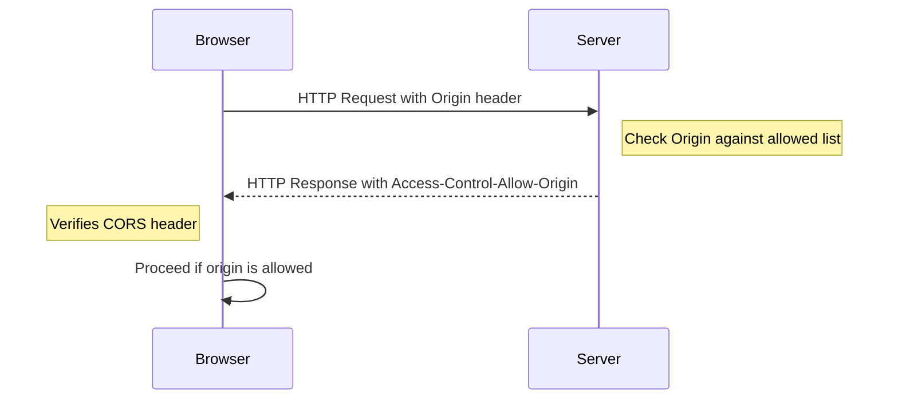

# Building a Multi-Tenant Todo Server in Rust: Part 1

---

## Introduction

Greetings! It's been a while since I delved deep into the world of Rust. While I have been busy with other projects and languages, the call of the Rustacean inside me has been strong. So, I decided to refresh my Rust skills but I wanted to do more than just basic Rust project. I wanted to try to build a full application that deals with multi-tenancy, authentication and authorization and has both backend and frontend. In order to achieve that I decided to build a multi-tenant Todo application.

When we speak about a multi-tenant app, we refer to software that can serve multiple users, each with their own isolated data. In our case, each user will log in using OAuth 2.0 protocol. We will use Auth0 to help us with authentication. We will also build command line based client to interact with the backend. This article, however, will be a humble beginning. We'll be focusing on setting up a basic server that can:

1. Add an arbitrary JSON object.
2. List all stored objects.
3. Retrieve a specific object by its ID.

Let's jump right in!

---

## Setting Up the Rust Project with Warp

Before we dive into the code, let's set up our Rust project. We will be using Warp framework to build API server.

Create a new project by running:

```
cargo new todo-rs
```

Navigate into your project:

```
cd todo-rs
```

Update your `Cargo.toml` with the necessary dependencies:

```toml
[dependencies]
warp = "0.3"
tokio = { version = "1", features = ["full"] }
nanoid = "0.3"
serde = { version = "1.0", features = ["derive"] }
serde_json = "1.0"
```

With the dependencies in place, we're ready to set up our application server.

---

## Defining the Object Type

Before we start accepting and storing objects, we need a clear definition of what our object looks like. This not only helps in data consistency but also keeps our code clean. Here's the structure of our object:

```rust
// object.rs
use serde::{Deserialize, Serialize};

#[derive(Debug, Serialize, Deserialize, Clone)]
pub struct Object {
    pub id: String,
    pub data: serde_json::Value,
}
```

The `Object` structure has two fields: `id` and `data`. The `id` will be a unique identifier generated by our server, and `data` will be the arbitrary JSON data provided by the client.

For `id` we will use nanoid of length 9. More on this later.

---

## In-Memory Store

For now we will use HashMap to store our objects so we don't have deal with database yet. Let's create a new file `store.rs` and add the following code:

```rust
use std::collections::HashMap;
use std::sync::Arc;
use tokio::sync::RwLock;
use warp::Filter;
use crate::error;
use crate::object::Object;

#[derive(Clone)]
pub struct Store {
    pub objects: Arc<RwLock<HashMap<String, Object>>>,
}

impl Store {
    pub fn new() -> Self {
        Store {
            objects: Arc::new(RwLock::new(HashMap::new())),
        }
    }
}
```

This creates a new `Store` struct that holds a `HashMap` of `Object`s. We'll use this to store our objects in-memory for now. However, we will need to use `Arc` and `RwLock` to ensure our store is thread-safe.

---

## Implementing the Routes

Let's build our route handlers:

1. `get_object_route`: Fetches a specific object by its ID.
2. `get_objects_route`: Lists all stored objects.
3. `add_object_route`: Adds a new object.

Create main.rs file and for now add the following functions that will implement routes:

```rust
// main.rs

// Fetches a specific object by its ID
async fn get_object_route(object_id: String, db: Db) -> warp::reply::Json {
    // ... (implementation)
}

// Lists all stored objects
async fn get_objects_route(db: Db) -> warp::reply::Json {
    // ... (implementation)
}

// Adds a new object
async fn add_object_route(new_object: Object, db: Db) -> warp::reply::Json {
    // ... (implementation)
}
```

These handlers interact with our in-memory database (a HashMap for now) to perform the necessary operations. Let's look how we can implement in-memory store.

### Add Object

Let's implement `add_object_handler` first. This handler will take a `Store` and a `serde_json::Value` as arguments. The `Store` will be used to access the in-memory database, and the `serde_json::Value` will be used to create a new `Object` to be stored.

```rust
async fn add_object_handler(store:Store, obj: serde_json::Value) -> Result<impl Reply, Rejection> {
    let mut objects = store.objects.write().await;
    let id = nanoid!(9);
    let store_obj = Object { id: id.clone(), value: obj };
    objects.insert(id, store_obj);
    Ok(StatusCode::CREATED)
}
```

Notice, that we are using `store.objects.write().await` to get mutable access to the `HashMap` and `objects.insert(id, store_obj)` to insert new object into the store.

`nanoid!(9)` is a macro that generates a random string of length 9. We will use this string as an ID for our object. We previously included `nanoid` crate in our `Cargo.toml` file.

### Get Object

Next, let's implement `get_object_handler`. This handler will take a `Store` and an `id` as arguments. The `Store` will be used to access the in-memory database, and the `id` will be used to fetch the corresponding `Object`.

```rust
async fn get_object_handler(id: String, store: Store) -> Result<impl Reply, Rejection> {
    let objects = store.objects.read().await;
    let object = objects.get(&id);
    match object {
        Some(value) => Ok(json(&value)),
        None => Err(warp::reject::custom(error::Error::NotFound)),
    }
}
```

Here, we're using `store.objects.read().await` to get immutable access to the `HashMap` and `objects.get(&id)` to fetch the corresponding `Object` by its ID.

If the object is found we return it as JSON, otherwise we return a `NotFound` error.

Let's talk about errors for a second. We will be using `warp`'s `Rejection` to handle errors. We will define our own error type in `error.rs` file:

```rust
use warp::{Rejection, Reply, reject::Reject, hyper::StatusCode, body::BodyDeserializeError};

#[derive(Debug)]
pub enum Error {
    InvalidId,
    NotFound,
}

impl std::fmt::Display for Error {
    fn fmt(&self, f: &mut std::fmt::Formatter) -> std::fmt::Result {
        match self {
            Error::InvalidId => write!(f, "Invalid ID"),
            Error::NotFound => write!(f, "Not found"),
        }
    }
}

impl Reject for Error {}
```

For now, we will need only two errors, one for handling not found object and another one for handling invalid format ID when calling `get_object_handler`.

### Get Objects

Finally, let's implement `get_objects_handler`. This handler will take a `Store` as an argument. The `Store` will be used to access the in-memory database.

```rust
async fn get_objects_handler(store: Store) -> Result<impl Reply, Rejection> {
    let objects = store.objects.read().await;
    let values: Vec<Object> = objects.values().cloned().collect();
    Ok(json(&values))
}
```

We need `store.objects.read().await` to get immutable access to the `HashMap` and `objects.values().cloned().collect()` to fetch all `Object`s from the store. We return all objects as JSON.

---

## Setup the Store and its Filter

Now that we have our handlers in place, we need to set up our store and its filter. We'll use the `warp::any` filter to create a `Store` instance and pass it to our handlers. In main.rs file add the following code:

```rust
async fn main() {
    let store = Store::new();
    let store_filter = warp::any().map(move || store.clone());

    .
    .
    .
}
```

In order to pass Store to our handlers we defined `store_filter` which holds a clone of the `Store` instance. We'll use this filter to pass the `Store` instance to our handlers.

---

## Setting Up the Router & Handling Object IDs

Now that we have `Store` ready we can define all three routes. We'll use `warp::path` to define our routes. In main.rs file add the following code:

```rust
    let get_object_route = warp::get()
        .and(warp::path("objects"))
        .and(valid_nanoid())
        .and(warp::path::end())
        .and(store_filter.clone())
        .and_then(get_object_handler);

    let get_objects_route = warp::get()
        .and(warp::path("objects"))
        .and(warp::path::end())
        .and(store_filter.clone())
        .and_then(get_objects_handler);

    let add_object_route = warp::post()
        .and(warp::path("objects"))
        .and(store_filter.clone())
        .and(warp::body::json())
        .and_then(add_object_handler);
```

For object identification, we'll use `nanoid` to generate a unique 9-character long ID. This ID will be created server-side when the object is added.

To ensure we're dealing with valid nanoid strings, we'll implement a custom filter:

```rust
// Code snippet from main.rs

fn valid_nanoid() -> impl Filter<Extract = (String,), Error = warp::Rejection> + Copy {
    warp::path::param()
        .and_then(|id: String| async move {
            if id.len() == 9 {
                Ok(id)
            } else {
                Err(warp::reject::custom(Error::InvalidId))
            }
        })
}
```

All we need to do is gather the routes and pass them to server:

```rust
    let routes = get_object_route
        .or(get_objects_route)
        .or(add_object_route);

    warp::serve(routes).run(([127, 0, 0, 1], 3030)).await;
```

## Error Handling

We are almost there but we still need to deal with any errors that handlers can run into. With Warp we can create custom error function that will convert these errors into correct responses.

Let's add `return_error` function to error.rs:

```rust
pub async fn return_error(err: Rejection) -> Result<impl Reply, Rejection> {
    let (code, message) = if let Some(error) = err.find::<Error>() {
        match error {
            Error::InvalidId => (StatusCode::BAD_REQUEST, error.to_string()),
            Error::NotFound => (StatusCode::NOT_FOUND, error.to_string()),
        }
    } else if let Some(error) = err.find::<BodyDeserializeError>() {
        (StatusCode::UNPROCESSABLE_ENTITY, error.to_string())
    } else if let Some(_) = err.find::<warp::reject::MethodNotAllowed>() {
        (StatusCode::METHOD_NOT_ALLOWED, "Method not allowed".to_string())
    } else if err.is_not_found() {
        (StatusCode::NOT_FOUND, "Not found".to_string())
    } else {
        (StatusCode::INTERNAL_SERVER_ERROR, "Internal server error".to_string())
    };

    Ok(warp::reply::with_status(message, code))
}
```

We can now add this function to our routes using `recover` filter. Back in main.rs update the code:

```rust
    let routes = get_object_route
        .or(get_objects_route)
        .or(add_object_route)
        .recover(return_error);
    warp::serve(routes).run(([127, 0, 0, 1], 8000)).await;
```

---

## Running the Server and Testing with Curl

With everything set up, you can run the server:

```
cargo run
```

Now, let's test our server:

1. Add a new object:

```
curl -X POST -H "Content-Type: application/json" -d '{"data": {"name": "John Doe", "task": "Write Rust article"}}' http://localhost:3030/object
```

2. List all objects:

```
curl http://localhost:3030/objects
```

3. Fetch a specific object by its ID:

```
curl http://localhost:3030/object/{object_id}
```

Replace `{object_id}` with the actual ID you received when adding the object.

---

## Testing Error Handling

Our server gracefully handles errors. For example:

1. Sending an invalid JSON:

```
curl -X POST -H "Content-Type: application/json" -d '{"data": "invalid json}' http://localhost:3030/object
```

This will return an `UNPROCESSABLE_ENTITY` error.

2. Fetching an object with an ID that's not 9 characters long:

```
curl http://localhost:3030/object/1234567890
```

The server will respond with an `InvalidId` error.

---

## Handling CORS

By default, web browsers follow the "Same-Origin Policy," which only allows web pages to make requests to the same origin that served the web page. While this is good for security, it's often limiting when modern, complex web applications need to fetch data from multiple domains or sub-domains. CORS is the technology that allows servers to relax the Same-Origin Policy, granting the browser permission to expose the response to frontend JavaScript code even when the origin is different.

If you try to access the server from a different domain, you'll notice that the server will reject the request. This is because of the same-origin policy. To allow cross-origin requests, we need to enable CORS.

CORS, or Cross-Origin Resource Sharing, is a security feature implemented by web browsers to control web requests made across different origins. An origin consists of the protocol (HTTP/HTTPS), domain, and port from which a web page originates. 

How does CORS work? When a browser detects a cross-origin request initiated by a frontend app, it automatically sets an HTTP Origin header in the request. The server then checks this header against its list of allowed origins. If the origin is allowed, the server sends a CORS header (Access-Control-Allow-Origin) in its response to indicate that the origin has permission. If the origin is not allowed, the server either doesn't include the CORS header, or explicitly denies the request, making the browser block the frontend code from accessing the resource. The server can also specify additional CORS headers to control other types of access, such as which HTTP methods are allowed or whether credentials can be included. CORS can be configured for simple requests, preflighted requests, and requests with credentials, each having its own set of headers and rules.



Fortunately enabling CORS in Warp is very easy. We just need to add define cors:

```rust
    let cors = warp::cors()
        .allow_any_origin()
        .allow_headers(vec!["User-Agent", "Content-Type"])
        .allow_methods(&[Method::GET, Method::POST]);
```

and then add them to routes:

```rust
    let routes = get_object_route
        .or(get_objects_route)
        .or(add_object_route)
        .with(cors)
        .recover(return_error);
```

---

## Data Persistence

We've built a basic server that can handle requests and return responses. However, the data is stored in memory and not persisted anywhere. If we restart the server, all the data will be lost. In the next article, we'll explore how to persist data using a database but for now let's just write the data to a file.  This way, when we restart server it can read it back from the disk.

### Reading Data

Let's start with reading data in.  We can do this as part of the Storage initialization.  First add attribute to Storage for file path:

```rust
use std::process;

.
.
.

pub struct Store {
    pub objects: Arc<RwLock<HashMap<String, Object>>>,
    file_path: String,
}

impl Store {
    pub fn new(file_path: String) -> Self {
        Store {
            objects: Arc::new(RwLock::new(Self::load(&file_path))),
            file_path,
        }
    }
```

Notice in the `new` function we call `load` to read the data from the file.  We'll implement that next

```rust
    fn load(file_path: &str) -> HashMap<String, Object> {
        match std::fs::read_to_string(file_path) {
            Ok(file) => serde_json::from_str(&file).unwrap_or_else(|_| {
                eprintln!("Failed to parse the JSON. Exiting...");
                process::exit(1);
            }),
            Err(e) if e.kind() == std::io::ErrorKind::NotFound => {
                // File not found, continue
                HashMap::new()
            }
            Err(e) => {
                eprintln!("An error occurred while reading the file: {}...", e);
                process::exit(1);
            }
        }
    }
```

This function will read the file and parse it into a HashMap.  If the file doesn't exist, it will return an empty HashMap.  If there is an error reading the file, it will print the error and exit the program.

`eprintln!` is similar to `println!` except it prints to the standard error stream instead of standard output.  This is useful for printing errors.

We need to also update main.rs to provide the path to the file we are going to use for storage:

```rust
    let store = Store::new("./data.json".to_string());
```

Now whenever service starts it will look for this file and load the data from it.  If the file doesn't exist, it will create an empty HashMap.  But how to we write the data to the file?

### Writing Data

To write data to the file we will code a `shutdown` function where will save all the data to the file.  `shutdown` will be called when the server is shutting down.

Let's code `shutdown` first in the store.rs:

```rust
    pub async fn shutdown(&self) -> std::io::Result<()> {
        let data = self.objects.read().await;
        let json = serde_json::to_string(&*data).expect("Failed to save data!");
        tokio::fs::write(&self.file_path, json).await
    }
```

Now we need to call this function when we detect CTRL-C signal.  We can use `tokio::select!` to detect that condition:

```rust
    tokio::select! {
        _ = warp::serve(routes).run(([127, 0, 0, 1], 3030)) => {
            println!("Server started at http://localhost:3030");
        }
        _ = tokio::signal::ctrl_c() => {
            println!("Ctrl-C received, shutting down...");
            store.shutdown().await.unwrap();
        }
    }
```

So far so good, however, compiling the code will result in an error:

```bash
error[E0382]: borrow of moved value: `store`
  --> src/main.rs:66:13
   |
27 |     let store = Store::new("./data.json".to_string());
   |         ----- move occurs because `store` has type `Store`, which does not implement the `Copy` trait
28 |     let store_filter = warp::any().map(move || store.clone());
   |                                        ------- ----- variable moved due to use in closure
   |                                        |
   |                                        value moved into closure here
...
66 |             store.shutdown().await.unwrap();
   |             ^^^^^^^^^^^^^^^^ value borrowed here after move

For more information about this error, try `rustc --explain E0382`.
```

We can fix it by cloning the store before passing it to the closure:

```rust
async fn main() {
    let store = Store::new("./data.json".to_string());
    let store_for_routes = store.clone();
    let store_filter = warp::any().map(move || store_for_routes.clone());
    .
    .
    .
```

Now we can run the server and add objects.  When the server is shutdown, the data will be saved to the file.  If we restart the server, the data will be loaded from the file.

---

## Conclusion

In this part of the series, we've taken our first steps into building our multi-tenant Todo server. We set up the project, defined our object structure, implemented basic routes, and gracefully handled errors.

In the next article, we'll delve deeper into crafting Todo-specific APIs and explore the multi-tenant aspect of our application further. Stay tuned, and happy coding!

---

_Note: The code snippets provided are concise representations. The full code can be found in the attached files._
